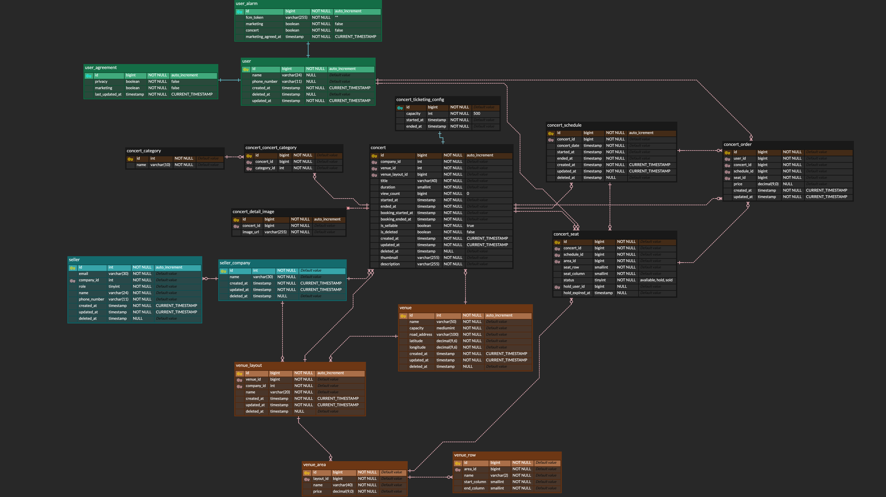
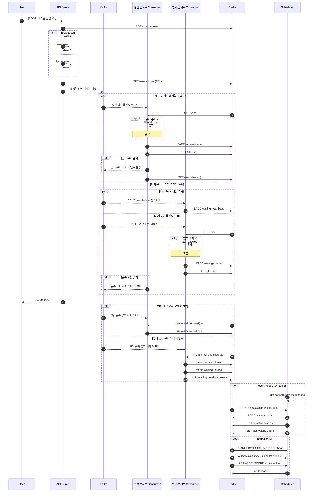

## Concert Ticketing

Kafka 기반 EDA와 Redis 캐싱을 활용한 티켓팅 시스템

<b>Tech Stack</b>

Backend: Java 17, Spring Boot 3.5, Spring Security, Spring Data JPA, QueryDSL, Spring Data Redis, Caffeine, MapStruct,
Scheduler

Database: MySQL, MongoDB, Redis

Messaging Queue: Confluent Kafka(Avro)

Infra: Docker, Docker-compose

Test: JUnit5, TestRestTemplate

 

<b>Project Structure</b>

### Multi Module

| Modules        | Description                                        |
|----------------|----------------------------------------------------|
| common-avro    | Avro 기반 Event Schema 정의 모듈                         |
| common-error   | 공통 RuntimeException 정의 모듈                          |
| common-kafka   | Topic 등 공통 Kafka 상수 정의 모듈                          |
| common-utils   | TimeUtils 등 수정 적은 유틸리티 모듈                          |
| domain-mongodb | MongoDB Domain, Repository 맟 Config 관리             |
| domain-rdb     | MySQL Domain, Repository, Config 및 Test Fixture 관리 |
| domain-redis   | Redis Domain, Repository 및 Config 관리               |
| kafka-consumer | kafka consumer 모듈                                  |
| scheduler-core | scheduler 모듈                                       |
| seller-api     | 판매자 API 모듈                                         |
| user-api       | 사용자 API 모듈                                         |

### Directories

| Directories | Description                                                                                   |
|-------------|-----------------------------------------------------------------------------------------------|
| database    | mysql, mongodb 및 redis [docker-compose.yml](./database/docker-compose.yml) / DDL, DML, config |
| kafka       | kafka, schema-registry 및 kafka-ui [docker-compose.yml](./kafka/docker-compose.yml)            |

 

<b>ERD</b>

 

<b>Sequence Diagram</b>

### 콘서트 대기열

---

 

<b>Core Feature</b>

### 1. 티켓팅 대기열 구현

---

콘서트 예매 시스템은 특정 기간에 트래픽이 몰리는 스파이크 트래픽 특성을 가지고 있습니다.
인기 콘서트인 경우, 예매 오픈과 동시에 사용자 요청이 집중되므로, 메시징 큐를 거치지 않고 API 서버에서 바로 대기열 진입을 처리할 경우, 데이터베이스와 API 서버에 부하가 걸려 장애가 발생할 수 있습니다.

이를 해결하기 위해 Kafka 메시징 큐를 도입하여 사용자 요청을 비동기적으로 처리하고, Redis ZSET을 활용하여 대기열 큐를 구현했습니다.

설계 과정에서 "모든 콘서트를 하나의 카프카 토픽에 두고 파티션만 늘릴 것인지" 아니면 "일반 콘서트와 인기 콘서트를 분리할 것인지"를 두고 고민했습니다.
전자의 경우 파티션 수를 늘리면 단기적으로 병렬 처리가 가능하지만, 인기 콘서트 트래픽은 특정 기간에만 집중되므로 해당 기간이 지나면 컨슈머 리소스가 장기간 유휴 상태가 되는 문제가 존재했습니다.
이는 비용적으로 비효율적이기 때문에, 후자의 방법을 선택했습니다.

일반 콘서트와 인기 콘서트를 별도의 토픽으로 분리할 경우, 인기 콘서트 예매가 진행되는 동안에도 일반 콘서트에서는 대기열이 발생하지 않아 사용자 경험이 개선되고, 예매 종료 이후 컨슈머를 내림으로써 리소스를 회수할
수 있었습니다.
이를 통해 일반 콘서트의 대기열 지연을 방지하고, 비용 효율성과 사용자 경험을 동시에 개선할 수 있었습니다.

### 2. Kafka 사용 이유

---

콘서트 예매 시스템에서 대기열 큐에 진입한 사용자를 활성화 큐로 이동시키는 작업은 ZADD같은 O(log N)의 시간복잡도를 가지는 명령어를 사용하기 때문에, 요청이 많을 경우 API 서버와 Redis에 부하를 줄
수 있습니다.
특히 트래픽이 몰리는 순간에는 응답 지연이나 서버 장애로 이어질 가능성이 높습니다.

이를 해결하기 위해, 대기열 진입 처리 자체는 Kafka 컨슈머에서 처리하도록 하고, 대기열 큐에서 활성화 큐로 이전하는 작업은 스케줄러에서 처리하도록 했습니다.
사용자가 대기열에 들어올 때 바로 API 서버가 Redis에 반영하는 대신, 이벤트를 Kafka로 발행해 컨슈머가 해당 유저를 Redis ZSET 대기열에 추가하는 구조입니다.
API 서버가 직접 Redis에 ZADD를 수행하는 경우 모든 요청이 곧바로 Redis에 쏠려 O(log N) 연산 병목이 발생할 수 있습니다.
이 문제를 해결하기 위해서 Kafka 이벤트를 발행하고, 실제 Redis ZADD 작업은 Kafka 컨슈머가 처리하도록 했습니다.

이 구조를 통해 트래픽이 순간적으로 폭증하더라도 Redis와 API 서버에 부하가 직접적으로 발생하지 않고, Kafka가 트래픽을 흡수합니다.
Consumer는 병렬성을 확보하면서도 처리 속도를 시스템 상황에 맞춰 자연스럽게 조정할 수 있어, 사용자 입장에서는 빠른 응답을 받고, 시스템 입장에서는 안정적으로 운영할 수 있습니다.

API 서버에서 Redis ZADD 명령을 사용하면 O(log(N))의 시간 복잡도를 가지기 때문에, 대기열에 입장시키는 작업이 오래 걸릴 수 있습니다.
따라서, 대기열에 입장시키는 작업을 카프카 컨슈머에서 처리하도록 했습니다.

Kafka 메시지는 파티션 단위로만 순서 보장을 하고 입장 인원 수에 따라 지연 작업을 처리할 수 없으므로 대기열 큐에서 활성화 큐로 이전하는 작업은 스케줄러에서 처리하도록 했습니다.

### 3. 대기열 큐 -> 활성화 큐 이전

---

대기열에 쌓인 사용자를 실제로 입장 가능한 활성화 큐로 이동시키는 과정은 단순 삽입 이상의 로직이 필요했습니다.
Kafka는 파티션 단위로만 순서를 보장하고, 메시지 단위의 지연 전달을 기본 기능으로 제공하지 않습니다.
그래서 "얼마나 많은 사용자를 어떤 주기로 활성화 큐에 투입할지"에 대한 속도 제어와 동적 지연 로직은 별도 구성 요소가 필요했습니다.

이를 해결하기 위해 스케줄러를 도입했습니다.
스케줄러는 일정 주기마다 Redis의 대기열 큐를 확인하고, 현재 활성화 큐에 남아 있는 사용자 수를 기준으로 주기를 동적으로 조정합니다.

- 인원이 적을 경우 주기를 짧게 해 사용자를 활성화 큐로 이동
- 인원이 많을 경우 주기를 길게 해 부하를 분산

단순 FIFO 기반의 무조건적 이동이 아니라, 활성화 큐의 현재 상태에 따라 이동 속도를 조절함으로써 부하를 최소화할 수 있었습니다.
그 결과, 트래픽이 몰리는 상황에서도 예측 가능한 속도로 사용자 입장이 가능했습니다.

### 4. 상태 조회

---

사용자가 대기열에 진입한 이후에는 자신의 순번을 주기적으로 확인해야 합니다.
Redis의 ZRANK 연산을 통해 사용자의 순번을 직접 계산하기에는 이 연산은 O(log N)의 시간 복잡도를 가지기 때문에, 사용자가 많아질수록 API 응답 속도가 느려지고 Redis 부하가 증가하는 문제가
발생합니다.
이는 곧 사용자 경험 저하와 장애 위험으로 이어질 수 있는 구조였습니다.

이 문제를 해결하기 위해, "실시간으로 필요한 정보"와 "백그라운드에서 처리해도 되는 정보"를 분리했습니다.
사용자가 즉시 알고 싶은 정보는 사실상 단순합니다.
내 앞에 몇 명이 있는지, 즉 현재 자신의 순번입니다.
따라서, 전체 ZSET에서 순번을 매번 찾는 대신, 진입 시 전체 대기 인원 수와 마지막으로 입장 처리된 사용자의 대기 인원 수를 Redis에 별도로 저장했습니다.

이 구조를 적용하면, 순번 조회는 O(1) 연산으로 고정되며 사용자 수가 아무리 늘어나도 성능 저하가 발생하지 않습니다.
또한, 예상 대기 시간은 스케줄러가 대기열 -> 활성화 큐로 이동시키는 작업에서 마지막 사용자의 대기 순번을 업데이트하면 되므로 추가 비용이 거의 없습니다.
이를 통해 실시간성이 중요한 순번 조회는 경량화하고, 대기 인원 계산은 비동기적으로 처리해 효율을 확보했습니다.
결과적으로 상태 조회 API의 응답 속도를 개선하고, Redis의 부하를 줄여 시스템 안정성을 높일 수 있었습니다.

### 5. JWT와 Opaque Token

---

대부분의 서버 인증은 JWT을 사용합니다.
JWT는 사용자 정보와 서명을 포함하고 있어 서버가 별도의 조회 없이 토큰만 복호화하면 인증이 가능합니다.
하지만 JWT의 구조적 특성 때문에 매 요청마다 서명 검증 및 복호화 작업이 필요합니다.
상태 조회 API처럼 초당 대규모 트래픽이 발생하는 경우, 이 복호화 작업 자체가 CPU-Bound 병목일 수 있습니다.

이를 해결하기 위해 대기열 진입 시부터는 JWT 대신 Opaque Token을 사용하도록 했습니다.
Opaque Token은 단순히 식별자 역할만 하며, 실제 사용자 정보는 Redis에 저장됩니다.
따라서, 상태 조회 시에는 Opaque Token을 Redis에서 조회하는 방식으로 인증이 이루어집니다.
이 방식은 JWT 복호화에 비해 훨씬 가볍고 빠르며, Redis 조회는 메모리 기반이므로 높은 처리량을 유지할 수 있습니다.

추가로 토큰 발행 과정도 최적화했습니다.
랜덤 문자열을 생성하려면 CPU 연산이 필요하므로, 토큰 발행 작업 자체가 API 서버에 부하를 줄 수 있습니다.
따라서 매 요청마다 새로운 Opaque Token을 생성하는 대신, 미리 Redis 리스트에 일정량의 토큰을 발행해두고 필요할 때마다 LPOP하여 사용하도록 했습니다.
만약 리스트에 Opaque Token이 부족할 경우, API 서버에서 즉시 발행하는 방식으로 보완했습니다.

이 구조를 통해 인증 과정에서 발생하는 CPU 부하를 최소화하고, 상태 조회 API의 응답 속도를 크게 개선할 수 있었습니다.

### 6. [Consumer Handler](./kafka-consumer/src/main/java/com/concertticketing/kafkaconsumer/common/handler)

---

Kafka Consumer를 구현하면서 이벤트 성격에 따라 서로 다른 처리 전략이 필요했습니다.
예를 들어, 조회수 업데이트 같은 단순 통계성 이벤트는 다소 중복되더라도 문제가 없으므로 Batch Auto-Commit 방식으로 처리해도 무방했습니다.
반면 환불 이벤트는 훨씬 민감한 이벤트였습니다.
사용자가 결제를 요청한 직후 외부 결제 모듈 지연이나 네트워크 지연으로 결제가 아직 완료되지 않은 상태에서 환불 요청이 들어올 수 있습니다.
이때 단순히 에러를 반환하면 사용자는 결제를 했음에도 환불이 불가능하다는 불편을 겪게 됩니다.

이 문제를 해결하기 위해 환불 이벤트 Consumer에는 Manual-Commit + Retry 전략을 적용했습니다.
수동 커밋을 사용하는 이유는, Consumer가 로직 처리 도중 죽었을 때 오프셋이 이미 Auto-Commit 되어 버리면 실제로는 처리되지 않은 이벤트가 재처리되지 않고 유실되기 때문입니다.
반대로 수동 커밋을 사용하면 비즈니스 로직이 정상적으로 끝난 뒤에만 오프셋을 커밋하기 때문에, 장애가 발생해도 메시지는 다시 재처리될 수 있습니다.
즉, 이벤트 유실을 방지하고 at least once 처리를 더 보장할 수 있습니다.
여기에 Retry 전략을 추가해 결제 지연이 해소되면 환불을 정상적으로 이어서 처리하고, n회 재시도 이후에도 실패한다면 DLQ로 이동시켜 후속 분석을 하던지 스케줄러와 함께 사용해 지연 후 재처리 시도도 가능하도록
설계했습니다.
결제 지연 문제를 100% 해결할 수는 없지만, 재시도를 통해 성공 확률을 높이고 사용자 경험을 개선할 수 있었습니다.

이처럼 이벤트마다 요구되는 전략이 다르다 보니 Consumer 코드가 중구난방으로 작성되면 유지보수성, 가독성 및 일관성이 떨어질 수밖에 없었습니다.
이를 방지하기 위해 Interface 기반으로 Consumer Handler를 정의했습니다.
모든 Consumer는 해당 Handler Interface를 구현하도록 처리해 인터페이스를 보고 이벤트 처리 방식을 쉽게 파악할 수 있도록 했습니다.
처리 경우로는 Commit 전략(Auto/Manual), 처리 방식(Single/Batch), Retry, DLQ를 명시적으로 선택할 수 있도록 했습니다.
이로써 Handler 로직 구현 시 일관성 있게 작성할 수 있었고, 새로운 이벤트가 추가되더라도 기존 구조를 쉽게 재사용할 수 있었습니다.

\* 실제 PG사와 연동해 결제 환불 로직은 구현하지 않았습니다.

### 7. Scheduler Local Cache & [LocalCacheManager](./scheduler-core/src/main/java/com/concertticketing/schedulercore/common/cache/LocalCacheManager.java)

---

대기열 -> 활성화 큐 전환 주기는 실시간 부하를
보며 [동적](./scheduler-core/src/main/java/com/concertticketing/schedulercore/config/SchedulerConfig.java)으로 조정합니다.
이때 필요한 정보는 예매 대상 콘서트, 현재 활성화 큐 인원 수와 활성화 큐 수용 한도입니다.
동적으로 변하는 주기를 계산하는 작업은 몇 초 단위로 반복 실행되므로, 매번 DB에서 예매 대상 콘서트 정보와 수용 한도를 조회하면 불필요한 부하가 발생할 수 있습니다.
위 두 정보는 예매 당일날 변하지 않는 데이터로 정의했으므로, 매번 DB를 조회하는 것은 비효율적입니다.

이를 개선하기 위해 스케줄러 내부에 Caffeine 기반 LocalCacheManager를 두어, 예매 대상 콘서트와 수용 한도를 메모리에 적재해 사용했습니다.
하루 1회(ex. 23:50) 또는 스케줄러 시작 시점에, 해당 날짜의 예매 가능한 콘서트와 수용 한도를 DB에서 조회해 캐싱하고, 이후 몇 초마다 실행되는 동적 지연 시간 연산에서는 Redis에서 활성화 큐 인원
수만 조회해 사용합니다.
이 방식으로 불필요한 DB 조회를 줄이고, 수 초 단위로 반복되는 스케줄러 작업의 성능을 개선할 수 있었습니다.

추가적으로, 만약 예외적으로 당일 예매 대상 콘서트 정보가 변경되는 상황이 생긴다면, Redis Pub/Sub을 활용해 스케줄러 캐시를 무효화하고 다시 로드하도록 해결할 수 있습니다.
현재 시스템에서는 당일 변경이 발생하지 않지만, 로컬 캐시를 사용해도 유연하게 대응할 수 있습니다.

### 8. Redis [Lua Script](./domain-redis/src/main/resources/scripts/retain_first_pop_rest.lua)

---

대기열 토큰 처리 과정에서 단순 Redis 명령만으로는 원하는 동작을 원자적으로 구현하기 어려운 경우가 있었습니다.
예를 들어, 리스트에서 첫 번째 요소(가장 최근 토큰)는 유지하면서 나머지 모든 요소는 꺼내와야 하는 상황이 있었습니다.
단순 LRANGE와 LTRIM 조합으로 처리하면 두 명령 사이에서 Race Condition이 발생할 수 있어, 동일 시점에 여러 요청이 들어오면 데이터 정합성이 깨질 우려가 있습니다.

이를 해결하기 위해 Lua Script를 작성해 Redis 서버 측에서 원자적으로 실행되도록 했습니다.
이렇게 Lua Script를 활용해 Redis 서버 단에서 원자성을 확보함으로써, 동시성 환경에서의 Race Condition 문제를 제거하고 네트워크 왕복 비용도 줄여 성능을 개선할 수 있습니다.

### 9. [Test Fixture](./domain-rdb/src/testFixtures/java/com/concertticketing/domainrdb/domain) & 공통 [Test Client](./seller-api/src/test/java/com/concertticketing/sellerapi/common/client/TestClient.java)

---

테스트 코드를 작성하면서 가장 크게 느낀 문제는 중복과 유지보수성이었습니다.
예를 들어, 콘서트나 공연장 같은 도메인 객체는 많은 테스트에서 필요했지만, 매번 동일한 코드를 반복 작성해야 했습니다.
이런 방식은 코드 중복을 불러오고, 데이터 생성 로직이 변경될 경우 전체 테스트 코드를 일일이 수정해야 하는 문제를 야기했습니다.

이를 해결하기 위해 Builder 패턴 기반의 Test Fixture를 도입했습니다.
Fixture는 도메인 객체 생성을 위한 공통 유틸로서, 기본값을 제공하면서 필요한 경우 선택적으로 값을 오버라이딩 할 수 있게 설계했습니다.
그 결과 테스트 객체 생성이 훨씬 단순해졌고, 중복 코드도 크게 줄어들었으며, 유지보수 또한 용이해졌습니다.
즉, Fixture 한 곳만 수정하면 전체 테스트 환경에서 동일한 개선 효과를 얻을 수 있게 되었습니다.

E2E 테스트에서도 반복되는 불편함이 있었습니다.
TestRestTemplate을 사용해 API 요청을 보낼 때, 요청/응답 로직과 JWT 인증 헤더 처리같은 공통 로직이 매번 중복되었습니다.
이를 개선하기 위해 별도의 공통 Test Client 클래스를 만들어, API 요청과 응답 검증 로직을 구현했습니다.
이 클라이언트는 API 요청(POST/GET/PUT/DELETE) 메서드를 래핑해두고, 공통 JWT 발급 및 Authorization 헤더 설정을 구현했습니다.

이렇게 하면 테스트 코드가 훨씬 간결해지고, 공통 로직 변경이 필요할 때 한 곳만 수정하면 되므로 유지보수가 훨씬 쉬워졌습니다.
예를 들어, 매 테스트마다 다른 유저가 필요해 유저를 생성하고 해당 유저 JWT를 헤더에 넣어야 하는 경우, Test Client에 메서드를 추가해 쉽게 처리할 수 있습니다.

Test Fixture와 공통 Test Client를 활용함으로써 테스트 코드의 중복을 줄이고 재사용성, 가독성과 유지보수성을 크게 향상시킬 수 있었습니다.

